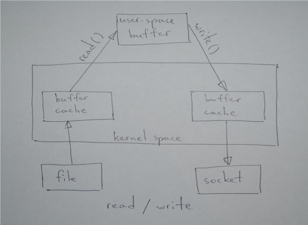
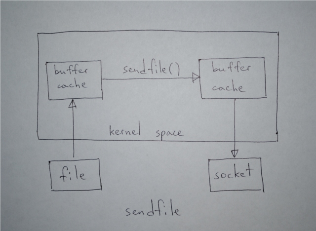

# Sendfile Optimization

This example demonstrates efficient file transfers using the `sendfile(2)` system call.

## Concept

Normally, sending a file requires reading into user space and writing to a socket:

```python
import os
while True:
    data = os.read(filefd, 4096)
    if not data:
        break
    os.write(socketfd, data)
```

This is inefficient because data bounces between user and kernel space.



## The Optimization

`sendfile` copies data directly from a file descriptor to a socket descriptor in kernel space.



## Python Support

Python provides [`os.sendfile`](https://docs.python.org/3/library/os.html#os.sendfile) as part of the standard library.

## References

- [sendfile(2) man page](http://www.kernel.org/doc/man-pages/online/pages/man2/sendfile.2.html)